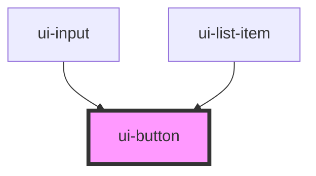

# ui-button

<!-- Auto Generated Below -->

## Properties

| Property | Attribute | Description | Type                              | Default    |
| -------- | --------- | ----------- | --------------------------------- | ---------- |
| `link`   | `link`    |             | `boolean`                         | `false`    |
| `toLeft` | `to-left` |             | `boolean`                         | `false`    |
| `type`   | `type`    |             | `"button" \| "reset" \| "submit"` | `'button'` |
| `wide`   | `wide`    |             | `boolean`                         | `false`    |

## Events

| Event            | Description | Type               |
| ---------------- | ----------- | ------------------ |
| `button-clicked` |             | `CustomEvent<any>` |

## Dependencies

### Used by

 - [ui-input](../ui-input)
 - [ui-list-item](../../molecules/ui-list-item)

### Graph

----------------------------------------------

*Built with [StencilJS](https://stenciljs.com/)*
