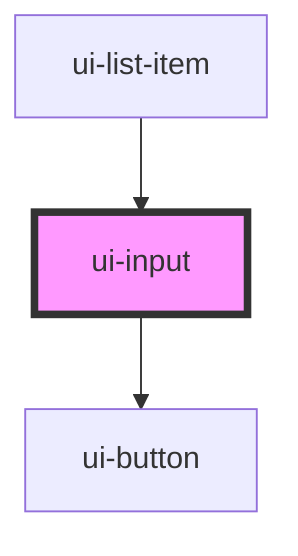

# ds-input

<!-- Auto Generated Below -->

## Properties

| Property      | Attribute     | Description | Type     | Default     |
| ------------- | ------------- | ----------- | -------- | ----------- |
| `placeholder` | `placeholder` |             | `string` | `undefined` |
| `value`       | `value`       |             | `string` | `undefined` |

## Events

| Event           | Description | Type               |
| --------------- | ----------- | ------------------ |
| `input-accept`  |             | `CustomEvent<any>` |
| `input-changed` |             | `CustomEvent<any>` |

## Dependencies

### Used by

 - [ui-list-item](../../molecules/ui-list-item)

### Depends on

- [ui-button](../ui-button)

### Graph

----------------------------------------------

*Built with [StencilJS](https://stenciljs.com/)*
