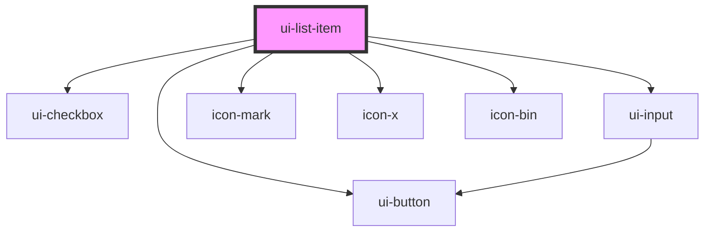

# ui-list-item

<!-- Auto Generated Below -->

## Properties

| Property | Attribute | Description | Type      | Default     |
| -------- | --------- | ----------- | --------- | ----------- |
| `done`   | `done`    |             | `boolean` | `undefined` |
| `last`   | `last`    |             | `boolean` | `false`     |
| `name`   | `name`    |             | `string`  | `undefined` |

## Events

| Event                   | Description | Type               |
| ----------------------- | ----------- | ------------------ |
| `list-item-change-name` |             | `CustomEvent<any>` |
| `list-item-delete`      |             | `CustomEvent<any>` |
| `list-item-done`        |             | `CustomEvent<any>` |

## Dependencies

### Depends on

- [ui-checkbox](../../atoms/ui-checkbox)
- [ui-input](../../atoms/ui-input)
- [ui-button](../../atoms/ui-button)
- [icon-mark](../../atoms/icons/icon-mark)
- [icon-x](../../atoms/icons/icon-x)
- [icon-bin](../../atoms/icons/icon-bin)

### Graph

----------------------------------------------

*Built with [StencilJS](https://stenciljs.com/)*
